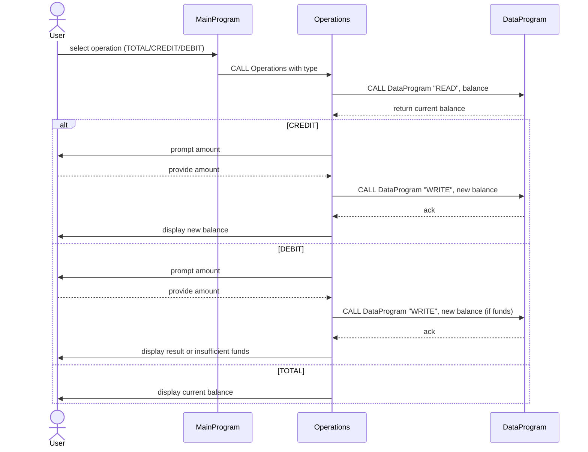

# COBOL Student Account System Documentation

This directory provides high-level information about the COBOL programs included in the project. Each program plays a specific role in managing a simple student account system, handling operations such as balance viewing, crediting, and debiting.

---

## Source Files

### `main.cob`

* **Purpose**: Entry point of the application. Provides a text-based menu that allows users to select account operations.
* **Key Logic**:
  * Displays menu options repeatedly until the user chooses to exit.
  * Captures user choice and invokes the `Operations` program with the appropriate operation code (`TOTAL`, `CREDIT`, `DEBIT`).
  * Handles invalid input and controls program flow.

### `operations.cob`

* **Purpose**: Implements the business logic for account operations based on the operation code received from `main.cob`.
* **Key Functions**:
  * `TOTAL`: Calls `DataProgram` to read and display the current balance.
  * `CREDIT`: Prompts for a credit amount, reads the current balance, adds the amount, writes the new balance back, and displays confirmation.
  * `DEBIT`: Prompts for a debit amount, reads the current balance, checks for sufficient funds, subtracts the amount if possible, writes the updated balance, and displays either success or an insufficient funds message.
* **Business Rules**:
  * Credits always succeed; debits require the available balance to be greater than or equal to the requested amount.
  * Invalid operations are not explicitly handled here but are managed by `main.cob`.

### `data.cob`

* **Purpose**: Maintains in-memory storage for the account balance and provides a simple read/write interface for other programs.
* **Key Functions**:
  * `READ`: Returns the stored balance value.
  * `WRITE`: Updates the stored balance with a new value.
* **Data Rules**:
  * The starting balance is initialized to `1000.00` in working storage.
  * Balance updates affect only the in-memory value; there is no persistence beyond program execution.

---

## Business Rules Summary

1. **Starting Balance**: The account begins with a default balance of `1000.00`.
2. **Viewing Balance**: Any user can view the current balance with no restrictions.
3. **Crediting**:
   * Users may add funds to their account.
   * The new balance is calculated by adding the credit amount to the current balance.
4. **Debiting**:
   * Users may withdraw funds only if sufficient balance exists.
   * If the requested debit exceeds the current balance, the operation is denied and an "Insufficient funds" message is shown.

---

Feel free to extend or modify these programs to add features such as account persistence, multiple accounts, input validation, or enhanced user interfaces.

---

## Sequence Diagram

Below is a mermaid sequence diagram illustrating the data flow through the main components of the application:

